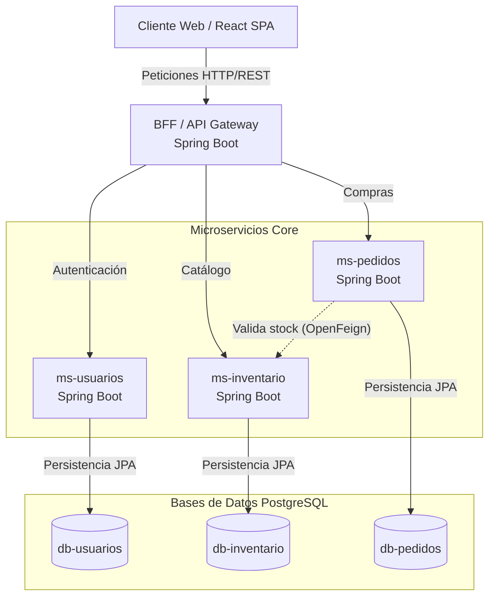
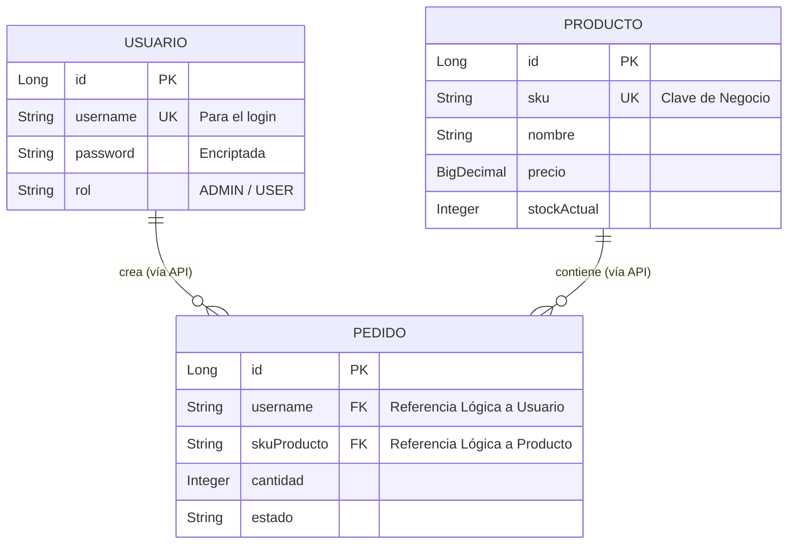

# Entregable: Arquitectura y Persistencia

## 1. Diagrama de Arquitectura de Sistemas (Microservicios)

Este es el diagrama macro que muestra cómo se comunican las aplicaciones (Frontend, BFF, Microservicios y Bases de Datos). Copia el siguiente código y pégalo en [mermaid.live](https://mermaid.live/) seleccionando "Flowchart".

---

## 2. Diagrama del Modelo de Datos (Entidad-Relación)

Este diagrama complementa al anterior, mostrando qué guarda cada base de datos por dentro y cómo se relacionan lógicamente.

> **Nota de Diseño sobre el Inventario:** En este modelo de datos, notarás que no existe una tabla aislada llamada `INVENTARIO`. La gestión de existencias está centralizada directamente en la entidad `PRODUCTO` mediante el atributo de control `stockActual`. Esta decisión arquitectónica evita una normalización excesiva y cruces de tablas innecesarios en esta etapa del sistema, manteniendo la consulta y deducción de stock altamente eficiente y lógicamente acoplada a la ficha del producto.

---

## 3. Descripción de la Persistencia de Datos

Copia y pega este texto en tu documento PDF. Es la explicación formal de tu estrategia de persistencia.

> ### Implementación de la Persistencia de Datos
> 
> En este proyecto, la persistencia de datos se garantiza utilizando el patrón arquitectónico **Database-per-Service** (una base de datos por microservicio). Esto asegura un bajo acoplamiento y un aislamiento total de fallos entre los dominios principales del E-commerce: Usuarios, Inventario y Pedidos.
> 
> **Tecnologías utilizadas:**
> 1. **Motor de Base de Datos:** Se utiliza **PostgreSQL**, un motor relacional robusto. Es fundamental para un E-commerce garantizar la integridad transaccional (cumplimiento ACID) para que las deducciones de stock y la creación de pedidos sean precisas y consistentes.
> 2. **Capa de Acceso a Datos (ORM):** Se implementó **Spring Data JPA** (basado en Hibernate). Esta tecnología actúa como un Mapeador Objeto-Relacional (ORM), abstrayendo la complejidad de las consultas SQL tradicionales y previniendo vulnerabilidades como la Inyección SQL.
> 3. **Patrón Repositorio:** El acceso a la base de datos se centraliza a través de interfaces `JpaRepository` (ej. `ProductoRepository`, `PedidoRepository`). Esto permite a la capa de servicios interactuar con los datos a través de objetos de dominio (Entidades Java) de forma limpia y mantenible.
> 
> **Manejo de Relaciones (Claves Foráneas Lógicas):**
> Dado que las bases de datos están físicamente separadas, no se utilizan restricciones de *Foreign Keys* físicas. En su lugar, se emplean **referencias lógicas** (como el `SKU` del producto o el `username` del usuario). La integridad referencial se valida de manera asíncrona o sincrónica mediante llamadas HTTP (API REST vía OpenFeign) entre los microservicios.
> 
> **Persistencia en Contenedores:**
> A nivel de infraestructura, las bases de datos se despliegan mediante contenedores Docker. Para garantizar que los datos persistan incluso si los contenedores se reinician o destruyen, se configuraron **Docker Volumes** (`pgdata_inventario`, `pgdata_pedidos`, `pgdata_usuarios`) mapeados directamente a las instancias de PostgreSQL.
